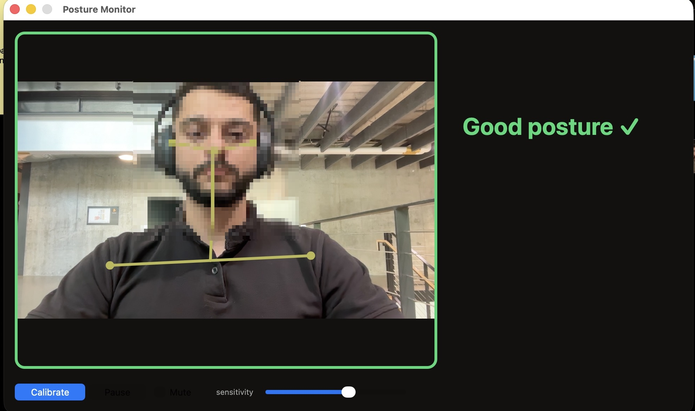

# PostureMonitor

A native macOS app that watches you through your laptop camera and **nudges you when you slouch** — no wearable, no cloud. All processing is on-device; nothing is recorded and your video never leaves the Mac.



▶ **[10-second demo](docs/demo.mp4)** (watch it catch a slouch).

---

## What it does

- Learns your **upright baseline** when you calibrate, then watches for drift.
- Detects a slouch from **two signals**, so it catches the different ways people slump:
  | signal | catches | how |
  |---|---|---|
  | head drops vs shoulders | leaning your head down/forward | MediaPipe: nose vs shoulders |
  | whole body sinks | slumping straight down | Apple Vision: absolute head height |
- Only nudges on a **sustained** slouch (an 8-second grace), with **hysteresis** so it doesn't flicker — a quick glance down won't nag you.
- A calm readout: **"Good posture ✓"** or **"Slouching — sit up in 5s…"** counting down, plus a sound and an optional spoken reminder.
- Live MediaPipe skeleton drawn over your camera.

## Quick start

**Prerequisites:** macOS, **Xcode command-line tools** (`xcode-select --install`), and **Python 3.9–3.12** (MediaPipe doesn't support 3.13+ yet — `brew install python@3.12` if your default is newer).

```bash
git clone <your-repo-url> posture-monitor
cd posture-monitor
./start.sh        # first run builds the app + sets up the server (~2 min), then launches
```

`start.sh` checks the prerequisites, builds the app once, sets up a local Python venv, downloads the MediaPipe model, starts the server, and opens the app. After that, just run `./start.sh` to launch.

Then **sit up tall and click "Calibrate"** (or wait ~6s for auto-calibration) — that's your baseline. Slouch from there and it'll nudge you.

> Tip: `alias posture='/full/path/to/posture-monitor/start.sh'` in your `~/.zshrc`, then just type `posture`.

## How it works

```
posture-monitor/
  app/      native macOS app (Swift, AppKit + Apple Vision) — built by app/build.sh
  server/   MediaPipe pose server (FastAPI) — run.sh sets up its venv + model itself
  tools/    dev/experiment scripts (analysis, the labeled-data harness, face-blur) — not needed to run
  start.sh  one command: server + build (first run) + open the app
```

- The **app** owns the camera, runs Apple Vision (face position) every frame, and POSTs downscaled frames to the local **server** for MediaPipe pose landmarks (shoulders, ears). It fuses both into the two slouch signals above.
- The server runs on `127.0.0.1:8077` (localhost only); it stores nothing.

**Tuning** — drag the in-app sensitivity slider, or create `~/.posturemonitor.json`:

```jsonc
{
  "slouchThresh": 0.87,    // head-drop ratio that counts as slouching (lower = less sensitive)
  "headYMargin": 0.05,     // absolute head-sink that counts as slouching
  "slouchGrace": 8,        // seconds of slouch before it nudges
  "slouchCooldown": 45,    // min seconds between nudges
  "speakAlerts": false     // also say "sit up straight" out loud
}
```

## Privacy

Everything runs locally — Apple Vision in the app, MediaPipe in a localhost server. **No video, frames, or data are recorded or sent anywhere.**

## How we got here

Most of our strong intuitions were wrong — the "lean" signal turned out to be statistical noise, one signal beat a four-signal fusion, and a vision-LLM judge only hit ~65%. The full experiment log, data, and stats are in **[TECHNICAL.md](TECHNICAL.md)**.

## License

MIT (see LICENSE).
