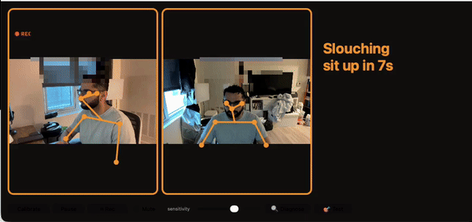

# PostureMonitor

A native macOS app that watches you through your laptop cameras and **nudges you when you slouch** — no wearable, no cloud. All processing is on-device; your video never leaves the Mac.



*Green = sitting tall. Red = slouching → sit up. Two camera angles, live skeleton tracking, a gentle nudge after you've held a slouch for a few seconds.*

---

## What it does

- Learns your **upright baseline** when you calibrate, then watches for drift.
- Detects a slouch from **three independent signals**, so it catches the different ways people slump:
  | signal | catches | how |
  |---|---|---|
  | head drops vs shoulders | leaning your head down/forward | MediaPipe nose vs shoulders |
  | whole body sinks | slumping straight down | Apple Vision absolute head height |
  | head juts forward | forward-head posture (eyes still up) | side camera: ear ahead of shoulder |
- Only nudges on a **sustained** slouch (grace period), with **hysteresis** so it doesn't flicker — a quick glance down won't nag you.
- A calm readout: **"Good posture ✓"** or **"Slouching — sit up in 5s…"** counting down, plus a sound and an optional spoken reminder.
- Live MediaPipe skeleton drawn over each camera.

**Cameras:** the built-in webcam is enough. A **second camera** (an iPhone via Continuity Camera, or any USB webcam at ~45° to your side) adds forward-head detection — the posture problem a front camera can't see.

## Quick start

Requirements: **macOS**, **Xcode command-line tools** (`xcode-select --install`), and **Python 3.9–3.12** (for the pose server; `brew install python@3.12` if needed).

```bash
git clone <your-repo-url> posture-monitor
cd posture-monitor
./start.sh        # first run builds the app + sets up the server (~2 min), then launches
```

Then **sit up tall and click "Calibrate"** (or wait ~6s for auto-calibration). That's your baseline — slouch from there and it'll nudge you.

Run it any time with `./start.sh`. (Tip: `alias posture='/full/path/to/posture-monitor/start.sh'` in your `~/.zshrc`.)

## How it works

```
posture-monitor/
  app/      native macOS app (Swift, AppKit + Apple Vision) — built by app/build.sh
  server/   MediaPipe pose server (FastAPI) — run.sh sets up a venv + model itself
  start.sh  one command: starts the server, builds (first run) + opens the app
```

- The **app** owns the cameras, runs Apple Vision (face position) every frame, and POSTs downscaled frames to the local **server** for MediaPipe pose landmarks (shoulders, ears). It fuses both into the three slouch signals above.
- The server runs on `127.0.0.1:8077` (localhost only). It downloads the MediaPipe model on first run.

**Tuning** — drag the in-app sensitivity slider, or edit `~/.posturemonitor.json`:

```jsonc
{
  "slouchThresh": 0.87,      // head-drop ratio that counts as slouching (lower = less sensitive)
  "headYMargin": 0.05,       // absolute head-sink that counts as slouching
  "sideSlouchMargin": 6,     // degrees of forward-head that counts as slouching
  "slouchGrace": 8,          // seconds of slouch before it nudges
  "slouchCooldown": 45,      // min seconds between nudges
  "speakAlerts": false,      // also say "sit up straight" out loud
  "sideCamera": true         // use a second camera for forward-head
}
```

## Privacy

Everything runs locally — Apple Vision in-app, MediaPipe in a localhost server. **No video, frames, or data ever leave your machine.** An optional vision-LLM feature (camera-setup coaching) is **off by default** and only runs if you set an `ANTHROPIC_API_KEY`.

## How we got here

This wasn't obvious — we tried a lot, measured everything, and most of our strong intuitions were wrong (the "lean" signal turned out to be noise; one signal beat a four-signal fusion; a vision-LLM judge only hit ~65%). The full experiment log, data, and stats are in **[TECHNICAL.md](TECHNICAL.md)**.

## License

MIT (see LICENSE).
